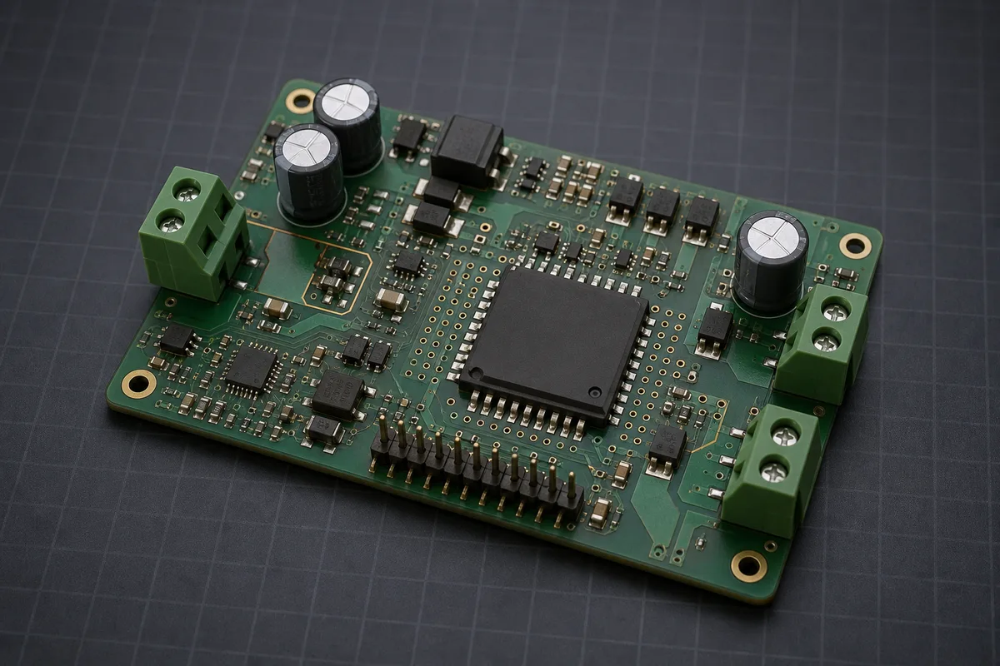
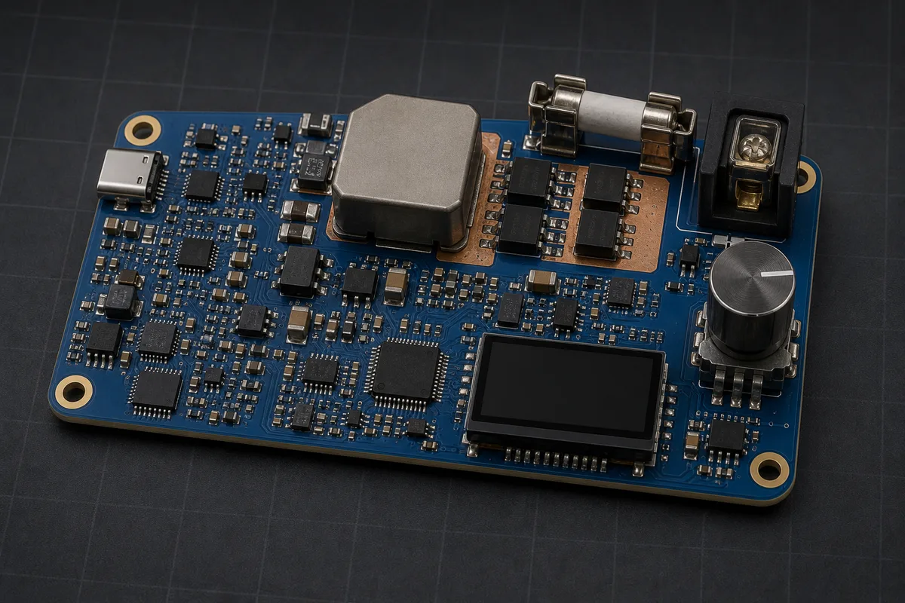

# Examples

Product briefs for `copperhead create`, plus example change requests for `copperhead do`, sorted by how hard they are for the agent.

Difficulty here is not "how impressive is the product". It tracks how much the agent has to hold in its head at once: how many subsystems interact, how many budgets constrain each other, and how much of the design is decided by tradeoffs rather than by a reference schematic.

| Tier | Brief | What makes it this tier |
| --- | --- | --- |
| Simple | [usb-c-breakout.md](simple/usb-c-breakout.md) | One connector, passives, no firmware, no budgets in tension |
| Simple | [rp2040-blinky.md](simple/rp2040-blinky.md) | Single MCU with a vendor reference design to follow |
| Simple | [coin-cell-led-beacon.md](simple/coin-cell-led-beacon.md) | Pulse-current vs. battery-life budget, no firmware |
| Medium | [dual-brushed-dc-motor-driver.md](medium/dual-brushed-dc-motor-driver.md) | Stall-current sizing, thermal limits, and regenerative braking |
| Medium | [esp32-soil-sensor.md](medium/esp32-soil-sensor.md) | Battery budget vs. radio duty cycle, ADC accuracy, sleep current |
| Medium | [usb-midi-controller.md](medium/usb-midi-controller.md) | Pin count pressure, mechanical constraints, USB compliance |
| Hard | [usb-c-pd-bench-supply.md](hard/usb-c-pd-bench-supply.md) | PD contracts, 100W conversion, thermal and cable limits |
| Hard | [lifepo4-bms.md](hard/lifepo4-bms.md) | Safety-critical, high current, thermal and isolation constraints |
| Hard | [gnss-lora-tracker.md](hard/gnss-lora-tracker.md) | Two RF chains, antenna coexistence, power budget across three modes |

## Featured brief previews

| Simple | Medium | Hard |
| --- | --- | --- |
| [](simple/coin-cell-led-beacon.md) | [](medium/dual-brushed-dc-motor-driver.md) | [](hard/usb-c-pd-bench-supply.md) |
| [Coin-cell LED locator beacon](simple/coin-cell-led-beacon.md) | [Dual brushed-DC motor driver](medium/dual-brushed-dc-motor-driver.md) | [100W USB-C PD programmable bench supply](hard/usb-c-pd-bench-supply.md) |

These previews are AI-generated concept renders, not KiCad outputs. They can communicate early layout intent, but they are not evidence of component selection, placement, routing, clearances, or verification. Any placement idea taken from a render must first become an explicit design constraint and then be checked in the actual KiCad project.

## Running one

```bash
mkdir my-board && cd my-board && git init
copperhead create --brief ../copperhead/examples/simple/usb-c-breakout.md
```

The pipeline is resumable. If a stage fails, rerun the same command and it picks up where it stopped.

Start with a simple brief the first time you point copperhead at anything. The hard briefs exercise the parts of the loop most likely to need a human pushing back, especially budget refusals and part substitutions.

### One brief is meant to fail

[gnss-lora-tracker.md](hard/gnss-lora-tracker.md) is deliberately over-constrained: its 2.5J energy-per-cycle budget cannot be met alongside its 30 second time-to-fix. A successful run does not produce a design that satisfies both. It produces a refusal with the arithmetic shown and a counter-proposal.

Every other brief closes on its numbers, and the medium briefs close with roughly 20% margin, so a refusal on those is a signal that something went wrong rather than a demo of the safety rail.

## Change requests for `copperhead do`

These run against a repo that already has a schematic and `docs/`. Same grading.

### Simple

Single-file edits with an obvious correct answer. The agent's job is mostly to propagate the change everywhere it is referenced.

```bash
copperhead do "add a 100nF decoupling cap on the 3V3 rail at U2"
copperhead do "change R4 from 10k to 4.7k and update the pull-up rationale in SUBSYSTEMS.md"
copperhead do "rename net SDA to I2C0_SDA everywhere"
copperhead do "add test points on 3V3, GND, and the reset line"
copperhead do "swap the USB connector footprint for the through-hole-tab variant"
```

### Medium

The change has a right answer, but reaching it means reading a constraint or a budget first.

```bash
copperhead do "add an external key jack on a spare GPIO"
copperhead do "move the status LED off GPIO2 so the board still boots with the LED fitted"
copperhead do "raise the charge current to 500mA and check it against the thermal budget"
copperhead do "add reverse-polarity protection on the battery input without breaking the sleep current budget"
copperhead do "give the ADC its own filtered supply and document why"
copperhead do "add a second I2C device at 0x48 and confirm no address collision"
```

### Hard

The agent has to weigh competing constraints, and the correct outcome may be a refusal or a counter-proposal rather than an edit. These are the ones worth running with `--interactive`.

```bash
copperhead do "cut sleep current to under 10uA"
copperhead do "fit the design on a 2-layer board instead of 4 and tell me what that costs"
copperhead do "replace the buck regulator with a cheaper part with the same ripple performance"
copperhead do "double the battery life without changing the cell"
copperhead do "add USB-PD sink at 9V and re-derate every part on the input rail"
copperhead do "the antenna is failing radiated emissions, propose fixes ranked by cost"
```

Two behaviours are worth watching for on the hard set. The agent should refuse a change that violates a recorded budget rather than quietly relaxing the budget, and it should treat the KiCad files as fact when they disagree with the docs. Both are specified in [SPEC.md](../openspec/specs/SPEC.md).

## Writing your own brief

The briefs here follow a shape that works well with the pipeline's first stage:

- **What it is**: one paragraph, in plain language.
- **Must do**: numbered functional requirements.
- **Budgets**: numbers with units. These become recorded constraints, and the agent will refuse later changes that break them.
- **Constraints**: form factor, cost ceiling, process limits, parts you already own.
- **Out of scope**: what not to build. Worth more than it looks.

Anything you leave out, the agent picks a default for and flags `ASSUMED` in `docs/SPEC.md`. Read those flags before the schematic stage: it is much cheaper to correct an assumption there than after layout.
