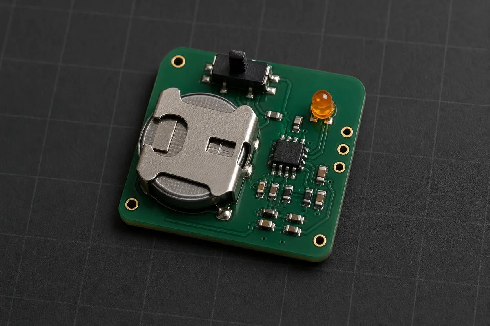

# Brief: Coin-cell LED locator beacon

*AI-generated illustrative concept render, not a KiCad output or placement reference; component selection and layout are intentionally unresolved.*

## What it is

A tiny battery-powered beacon that flashes one amber LED often enough to find a bag, key hook, or piece of test equipment in a dark room. It runs directly from a CR2032 coin cell and uses no firmware. The design exercise is making a visible pulse without treating the coin cell like a power supply that can deliver unlimited current.

## Must do

1. Flash one amber LED for 10ms every 2 seconds while switched on.
2. Start reliably across the full battery-voltage range without firmware or programming.
3. Provide a real slide power switch with no standby path around it.
4. Include test points for the battery rail and the LED pulse.
5. Hold the cell securely while making accidental reverse insertion difficult.

## Budgets

- Battery: one CR2032, 220mAh nominal, operating from 3.2V down to 2.0V.
- Average current: under 35uA measured over at least 60 seconds.
- LED pulse: 4mA nominal and no more than 5mA for 10ms.
- Target life: at least 180 days continuous operation after derating nominal cell capacity by 20%.
- Board area: 25mm x 20mm or smaller, including the cell holder and switch.
- BOM cost: under $2.50 at qty 100, excluding the battery.

## Constraints

- No MCU, programmable logic, or firmware.
- Every active part must operate correctly down to 2.0V.
- 2-layer, 1oz copper, standard low-cost process.
- Hand-solderable: 0603 or larger passives and no package with hidden pads.
- Account for timer quiescent current, capacitor leakage, LED duty cycle, and switch leakage in the average-current calculation.
- Check the cell's pulse behavior and internal resistance; add local energy storage if the LED pulse would pull the rail below any part's minimum voltage.

## Out of scope

- Rechargeable cells or charging.
- Motion, light, or proximity sensing.
- Wireless connectivity.
- Multiple LEDs, colors, or programmable patterns.
- An enclosure or key-ring mechanism.

## Notes

The deliberate trap is sizing from the LED's familiar 20mA headline current. A CR2032 has substantial internal resistance, especially when cold or partly discharged, so a large pulse can collapse the rail even when its average-current arithmetic looks acceptable. Show the worst-case sag from the cell resistance and the local capacitor before choosing the LED resistor.

The six-month target leaves about 40uA after the 20% capacity derating. The 35uA requirement preserves margin, but only if the timer and leakage currents are counted alongside the LED duty cycle. A classic bipolar 555 or a leaky timing capacitor can consume the budget before the LED flashes once.
